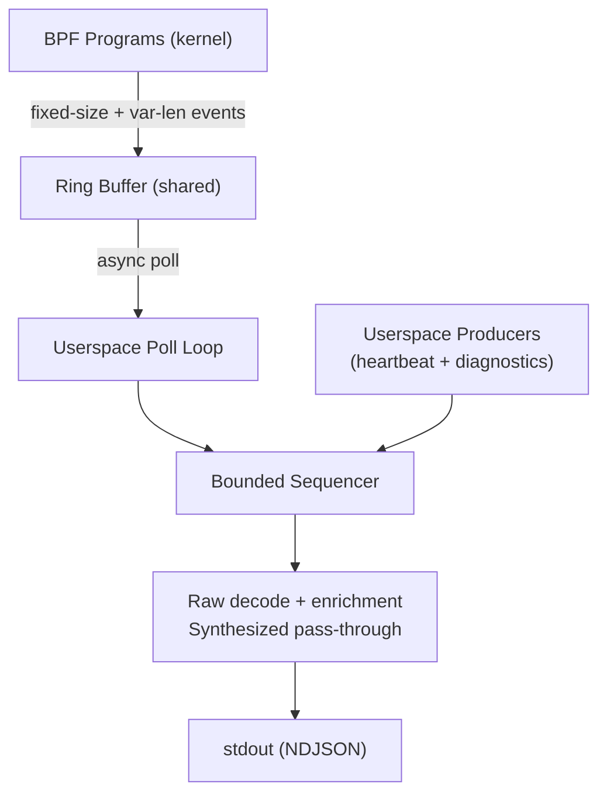

# Data Pipeline

## Ring Buffer Configuration

| Parameter         | Value    | Notes                                    |
|-------------------|----------|------------------------------------------|
| Map type          | RINGBUF  | Single shared buffer across all CPUs     |
| Size              | DECIDED  | Configurable via --ring-buffer-size;     |
|                   |          | default 4MB; must be power of 2          |
| Event ordering    | FIFO     | FIFO for records committed to this ring; |
|                   |          | not a total kernel causal order           |
| Overflow policy   | DECIDED  | Drop (bpf_ringbuf_reserve returns NULL); |
|                   |          | BPF global counter tracks drop count;    |
|                   |          | userspace polls counter periodically     |

## BPF-to-Userspace Event Format

BPF programs emit compact binary events into the ring buffer. These are
deserialized in userspace into the BehaviorEvent JSON schema (see
[output-schema.md](output-schema.md)).

Each BPF event from Layer 1-3 and LSM hooks carries at minimum:

- Event discriminant (u8: which hook produced it)
- Timestamp (u64: nanoseconds, see below)
- auid (u32)
- sessionid (u32)
- pid (u32)
- ppid (u32)
- process start-boottime (u64; paired with TGID as the stable process reference)
- comm ([u8; 16])
- Hook-specific payload (variable length)

**Exception: PACKET events (TC hooks)** do not have process context.
TC programs cannot access `task_struct`, so PACKET events carry only:

- Event discriminant (u8)
- Timestamp (u64)
- Full raw packet data (L2 and above, up to MTU)

Userspace populates `header.pid`, `header.ppid`, `header.auid`,
`header.sessionid`, and `header.comm` by joining against the socket
tracking table. See [tracing.md](tracing.md) Packet Capture section.

## Timestamp Strategy

The schema requires `timestamp` as integer nanoseconds from the VM's
`CLOCK_MONOTONIC` domain. BPF programs use `bpf_ktime_get_ns()`.
Userspace-synthesized records
use `clock_gettime(CLOCK_MONOTONIC)`. The integer nanoseconds are emitted
without conversion, so BPF, HEARTBEAT, USDT metadata, and diagnostics are
comparable within one VM run. A timestamp records observation provenance; it
does not establish total kernel causality or cross-boot comparability.

## Emission Ordering and Backpressure

Raw ring-buffer records and userspace-synthesized records enter one bounded
MPSC sequencer. Each producer retains FIFO order. Across producers, successful
channel admission defines order. The one receiver performs deserialization,
enrichment, lifecycle completion, and NDJSON serialization; line position is
therefore the canonical Bloodhound emission order.

Bounded pressure propagates through userspace to the ring-buffer consumer.
Kernel eBPF hooks are never blocked by this sequencer. If userspace cannot
drain the BPF ring buffer in time, `bpf_ringbuf_reserve` fails and the BPF drop
counter reports that distinct loss through HEARTBEAT.

## Stream Completeness

A rejected binary record becomes an in-band `DIAGNOSTIC/stream.health` before
the next raw record is processed. Its bounded arguments are:

- `reason_code = "deserialize_rejected"`
- `rejection_count_delta = 1`
- `rejection_count_total`
- `run_prefix_incomplete = true`

The rejected bytes are never included. Ring-buffer overflow remains distinct:
HEARTBEAT reports `reason_code = "ring_buffer_overflow"`,
`drop_count_delta`, `drop_count_total`, and `gap_detected`.
When the cumulative drop total is nonzero it also reports
`run_prefix_incomplete = true`.

`gap_detected` marks the interval since the previous heartbeat baseline as
indeterminate. Any cumulative loss marks the stream prefix incomplete for the
rest of that Bloodhound process run. Later clean intervals do not repair that
prefix. A downstream consumer may recover a particular conclusion only under
its own explicit reset, snapshot, or bounded-window semantics.
