# Developing trusted USDT collectors

## Purpose

A USDT collector turns one application-specific static probe into a bounded
Bloodhound behavior event. It is a compiled feature, not a general-purpose
runtime plugin: configuration may select a collector, but it may not define a
target, probe, argument layout, memory read, or output mapping.

This boundary exists because USDT metadata describes how to read a process at
a probe site. Accepting that metadata from a guest configuration would allow
untrusted input to control privileged tracing behavior. Bloodhound instead
reviews the complete contract as source code and compiles it into the daemon
and its eBPF object.

See [Trusted in-tree USDT collectors](../usdt-collectors.md) for the operator
interface. The notes under [devnotes/usdt-collectors](../devnotes/usdt-collectors/README.md)
record implementation discoveries; they are useful context, but are not the
design source of truth.

## Architecture

```mermaid
flowchart LR
    CONFIG["Selection file<br/>collector ID + enabled"]
    REGISTRY["Userspace registry<br/>trusted metadata"]
    ELF["Target ELF<br/>Build ID + .note.stapsdt"]
    ATTACH["Verified uprobe attachment"]
    BPF["Collector eBPF program<br/>bounded capture"]
    ABI["Shared binary payload<br/>EventKind + repr(C) struct"]
    DECODE["Collector decoder"]
    OUTPUT["BehaviorEvent<br/>NDJSON"]

    CONFIG --> REGISTRY
    REGISTRY --> ELF
    ELF --> ATTACH
    ATTACH --> BPF
    BPF --> ABI
    ABI --> DECODE
    DECODE --> OUTPUT
```



The implementation is split across these ownership boundaries:

| Area | Source | Responsibility |
|---|---|---|
| Selection and registry | `bloodhound/src/usdt.rs` | Reject unknown configuration, declare trusted target metadata, validate ELF notes, attach programs, decode collector payloads, and create diagnostics. |
| Startup integration | `bloodhound/src/main.rs`, `bloodhound/src/loader.rs` | Load selections, attach enabled collectors after the core BPF programs, keep links alive, and queue diagnostics. |
| Kernel capture | `bloodhound-ebpf/src/usdt.rs` | Read the fixed USDT operand ABI, bound memory access, and emit collector-owned payloads. |
| Shared wire ABI | `bloodhound-common/src/lib.rs` | Define event discriminants and `#[repr(C)]` payload structures shared by eBPF and userspace. |
| Generic dispatch | `bloodhound/src/deserializer.rs` | Route USDT event kinds to the collector decoder without learning collector-specific schemas. |
| Acceptance environment | `e2e/fixtures/`, `e2e/config/usdt.d/`, `e2e/tests/test_usdt.py` | Provide deterministic ELF targets and prove the probe-to-NDJSON path and rejection cases. |

## Invariants

Every collector change must preserve these properties:

- The selection file remains deny-by-default and contains only `collector` and
  `enabled`.
- Target path, architecture, Build ID, provider, probe, operands, field schema,
  and attachment limit are compiled metadata.
- Attachment happens only after the target architecture, Build ID, static note,
  exact operand string, and semaphore offset are validated.
- Probe locations come only from `.note.stapsdt`; there is no symbol fallback,
  runtime DSO scan, configured offset, or configured PID.
- eBPF emits fixed-size scalars and explicitly bounded byte strings. It never
  emits process pointers, surrounding memory, environment data, or unbounded
  text.
- Required capture failures become bounded `DIAGNOSTIC/usdt.collector` events;
  they do not produce partial semantic events.
- Collector-specific decoding stays in the USDT module. The core deserializer
  only dispatches by `EventKind`.
- All links survive for the daemon lifetime and are rolled back as one collector
  attachment if any of its locations fails.

Changing a target binary or any part of its probe ABI requires a new collector
version. Do not silently change an existing collector ID to mean a different
contract.

## Adding a collector

Treat a new collector as one vertical change through all layers:

1. Specify the semantic event, trusted executable path, Build ID allowlist,
   provider and probe names, exact operand string, field types, size bounds, and
   failure behavior.
2. Add an `EventKind` and collector payload structures in
   `bloodhound-common/src/lib.rs`. Keep layouts `#[repr(C)]`, fixed, and safe to
   read unaligned in userspace.
3. Add the probe program in `bloodhound-ebpf/src/usdt.rs`. Use one compiled
   entry point per supported static location and reject unsafe required reads
   with a collector-owned capture-error payload.
4. Register all trusted metadata in `bloodhound/src/usdt.rs`, map each static
   location to its compiled program name, and add the decoder that produces the
   canonical `BehaviorEvent`.
5. Add a deterministic target under `e2e/fixtures/`, pin its Build ID in the
   fixture build, install it into the guest image, and add only the collector ID
   and enabled state under `e2e/config/usdt.d/`.
6. Add unit coverage for registry, selection rejection, ELF/note validation,
   payload bounds, and decoding. Add privileged E2E coverage for the emitted
   event and relevant rejection or semaphore behavior.
7. Update the operator contract in `docs/usdt-collectors.md` when the registry,
   diagnostics, or observable event schema changes.

The registry, eBPF entry point, shared payload, decoder, and E2E fixture should
land together. A metadata-only registry entry cannot collect an event, and an
eBPF program without registry validation is outside the trust model.

## Verification

Run the focused userspace tests first:

```bash
docker build --target build -t bloodhound-usdt-test -f Dockerfile.build .
docker run --rm bloodhound-usdt-test \
  cargo test --package bloodhound usdt --target x86_64-unknown-linux-musl
```

Then run the privileged E2E suite in the QEMU/KVM environment described in
[`e2e/README.md`](../../e2e/README.md). A successful attachment log is not
acceptance evidence: the test must execute the fixture and observe the expected
fresh NDJSON event. Rejection tests must observe the expected bounded diagnostic.

The `USDT Unit and Replay Tests` workflow runs on Takumi Runner. The full E2E
workflow runs on a GitHub-hosted runner because it requires KVM, which Takumi
Runner does not provide as of 2026-08-01.

## Review checklist

- Is every runtime-controlled value limited to collector selection and enablement?
- Does the collector reject a wrong architecture, Build ID, probe, or operand ABI?
- Are all memory reads and serialized values bounded?
- Do shared payload layouts agree between eBPF and userspace?
- Are partial attachment and semaphore-backed links cleaned up on failure?
- Does E2E prove both probe execution and the final NDJSON shape?
- Does an incompatible target yield a documented reason code without leaking raw data?
